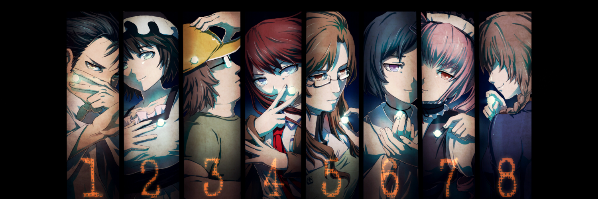
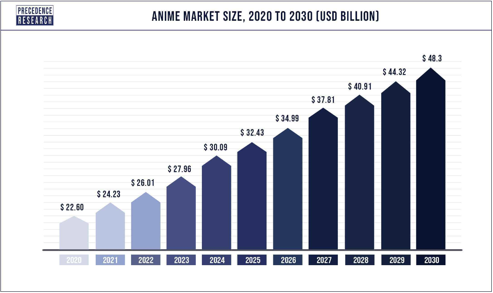
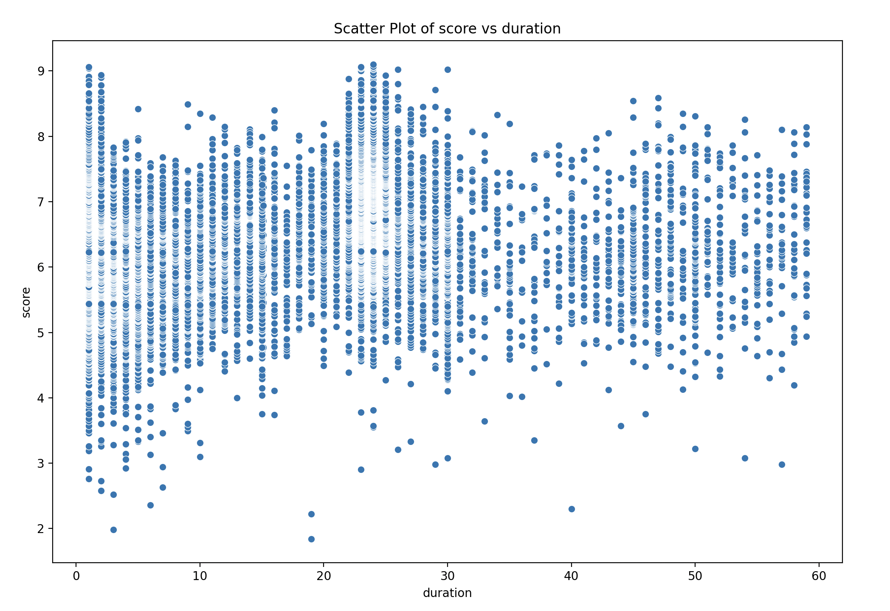
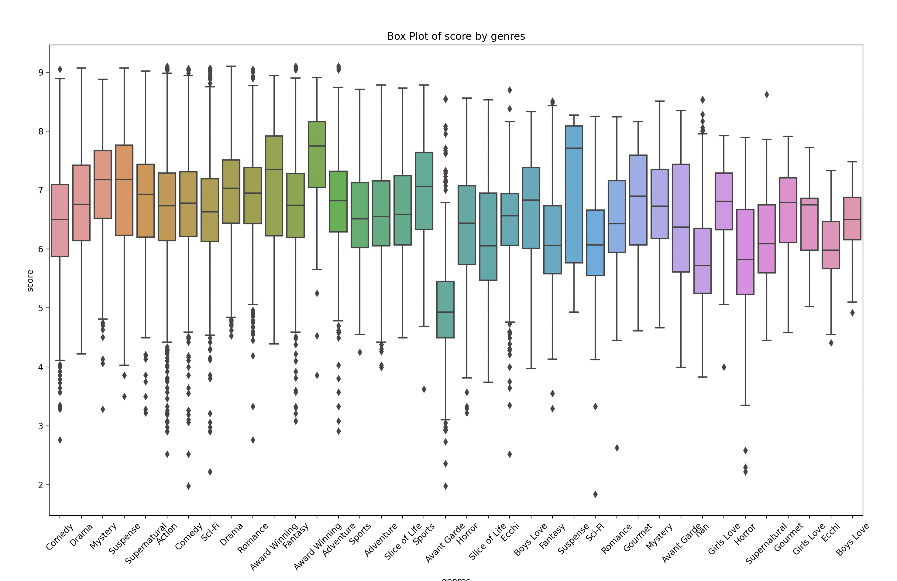

# Anime Recommender

# Business understanding

- ## Introduction to the Anime Industry
  - The anime industry has been growing rapidly, especially with the rise of streaming services. With so many anime titles out there, it's become essential to have good recommender systems that can help users find the content they’ll enjoy.
  This article will provide a relatively medior approach to creating an anime recommender system.
`It was once considered a niche genre just for hard-core fans, but streaming has helped turn it into a globally popular juggernaut. Now the Japanese animation industry is scrambling to meet an almost insatiable demand: "It’s increasingly becoming a borderless form of mass entertainment."`[1] 
- ## Business objectives:
  - The main goal of this anime recommender system is to boost user engagement and satisfaction by giving them personalized recommendations. This can lead to more watch time, more subscription renewals, and better user retention overall.
- ## Project Management Methodology
    - For this project, I followed the CRISP-DM (Cross Industry Standard Process for Data Mining) methodology. It’s a structured approach that helps in building a solid recommender system. Here’s a breakdown of each phase as it applies to our project.
        - #### Business understanding
            Users generally watch shows either by recommendations from others or simply what they find in the internet. But with a prebuilt recommender, say the one from Netflix, they will be able to find what they want to watch next relatively easily. Not only will this be a great advantage with the recommendation model, but it can also supply as a marketing tool to understand which shows are very popular and should the studio create certain merchandise products for.

            #### some market insight on the anime monetary status [2]
            
        - ### Data Understanding
            I gathered all the necessary data from the website [myAnimeList](https://myanimelist.net/) by ( long time ago ) creating a script that fetches the data from their builtin api.
            Understanding the data was crucial for building a solid recommender system.
            This data includes things like:
            - User ratings on anime
            - Allrank score of anime
            - Genres of the shows
            - Studios by which the show is produced
            ##### See following file: [anime dataset](../backend/data/anime_list.csv)
        - ### Data preparation
            The data collected was cleaned and preprocessed to ensure it was of high quality. This included handling missing values, normalizing data formats, and creating relevant features for the recommendation model.
            In an attempt to make this process more generic, you should be able to create a cleaning process that would work for multiple datasets without altering the code.

            By cleaning the data we have done the following:
            - Extracted the numerical values from the duration column as it was a non calculatable value ( a string of the format `1 hour 30 minutes` )
            -  Also extracted the numerical data from the rating column as it was also displayed as a string of the format `R - 17+`
            - Converting the favorites column to numerical value as it was a string, then normalized it by using the MinMaxScaler from sklearn.preprocessing.
            - For numerical missing values i used the mean of the column to fill the missing values.
            ##### See following file: [clean.py](../backend/preprocessing/clean.py)

        - ### Visualization
            After cleaning up the dataset and creating the pkl file on the dataset using the cosine similarity model, I used the pkl file to create a visualization of the dataset. This first visualization shows the correlation between how long an anime episode is and what score it got from the public. This information might be usefull for studios to design their episodes to be between 20 and 30 minutes long as those episodes tend to get higher scores.
            
            The second visualization shows the correlation between the anime score and the genre of the anime. As we can see in the plot, it seems that the anime genre has a medium correlation with the score. Therefore we can assume that wether you have a specific genre does not mean that you will get a high score, which might be a good indicator for the studio to create shows with various genres.
            As an extra visualization I also added the `dash` package to create an interactive chart for the user to check out correlations between certain genres.
            
            

        - ### Modelling
            The model I chose for this project is the Cosine_similarity model, I have considered using collaborative filtering but since I was not able to find any good datasets that included specific user likes with their respective animes, I decided to use the cosine similarity model.
            The cosine similarity model is very good for calculating the similarity between two vectors. In our case, the vectors are the inputted anime and the recommended animes. Not only does it work very well in this scenario, but it is also quite fast as the whole similarity matrix is predefined and can be used to find the most similar animes almost insantaniously.

### Evaluation
As evaluation, since this model is not a model where I can apply train and test data as it is all predefined in a matrix. So instead i used other websites like [anibrain](https://anibrain.ai/recommender/anime) and [ameo](https://anime.ameo.dev/), besides using existing recommenders I also ran the project by some large groups of anime watchers on Discord and some of my aquintances who are Anime fanatics. The results were mostly good, although some of the critics were that some shows did not quite fit in the theme of the anime and some of the shows were not very good.

### Extra's
Since I already have a slight background in software development, I thought it would be interesting to mix this project with a front-end UI so that the end-user can actually try out the model. And in the process of making this I decided to use `FLASK-CORS` for the backend to host the model.

### Conclusion & recommendations
This project demonstrates a structured approach to developing an anime recommender system using the CRISP-DM methodology. This project will be something that needs some work to make it functional for an extensive kind of datasets, which will definitely be something that is going to require some more work and learning.

### References
1. [hollywoodreporter](https://www.hollywoodreporter.com/business/business-news/japanese-anime-worlds-most-bankable-genre-1235146810/)
2. [precendenceresearch](https://www.precedenceresearch.com/anime-market)